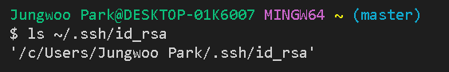
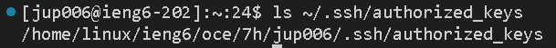
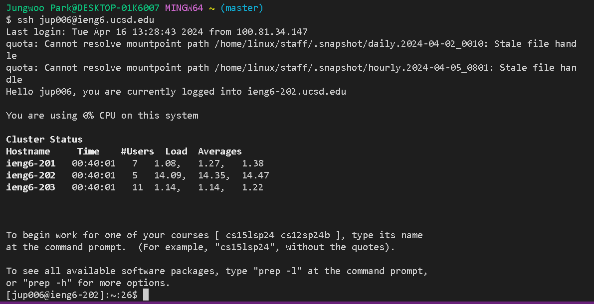

**Part1**
Code for `ChatServer.java`

```
import java.io.IOException;
import java.net.URI;
import java.net.URLDecoder;
import java.util.HashMap;
import java.util.Map;


class Handler implements URLHandler {
    StringBuilder chatLog = new StringBuilder();

    public String handleRequest(URI url) {
        if (url.getPath().equals("/")) {
            return "Welcome to the ChatServer! Use /add-message?s=<message>&user=<user> to post messages.";
        } else if (url.getPath().equals("/add-message")) {
            String query = url.getQuery();
            Map<String, String> params = parseQuery(query);
            if (params.containsKey("user") && params.containsKey("s")) {
                String user = params.get("user");
                String message = params.get("s");
                chatLog.append(user).append(": ").append(message).append("\n");
                return chatLog.toString();
            }
            return "Invalid request. Please make sure both 'user' and 's' parameters are included.";
        }
        return "404 Not Found!";
    }

    private Map<String, String> parseQuery(String query) {
        Map<String, String> result = new HashMap<>();
        if (query != null) {
            for (String param : query.split("&")) {
                String[] entry = param.split("=");
                if (entry.length > 1) {
                    try {
                        result.put(entry[0], URLDecoder.decode(entry[1], "UTF-8"));
                    } catch (IOException e) {
                        System.err.println("Error decoding parameter: " + param);
                    }
                } else {
                    result.put(entry[0], "");
                }
            }
        }
        return result;
    }
}

class ChatServer {
    public static void main(String[] args) throws IOException {
        if(args.length == 0){
            System.out.println("Missing port number! Try any number between 1024 to 49151");
            return;
        }

        int port = Integer.parseInt(args[0]);

        Server.start(port, new Handler());
    }
}
```
Code for `Server.java`
```
import java.io.IOException;
import java.io.OutputStream;
import java.net.InetSocketAddress;
import java.net.URI;

import com.sun.net.httpserver.HttpExchange;
import com.sun.net.httpserver.HttpHandler;
import com.sun.net.httpserver.HttpServer;

interface URLHandler {
    String handleRequest(URI url);
}

class ServerHttpHandler implements HttpHandler {
    URLHandler handler;
    ServerHttpHandler(URLHandler handler) {
      this.handler = handler;
    }
    public void handle(final HttpExchange exchange) throws IOException {
        // form return body after being handled by program
        try {
            String ret = handler.handleRequest(exchange.getRequestURI());
            // form the return string and write it on the browser
            exchange.sendResponseHeaders(200, ret.getBytes().length);
            OutputStream os = exchange.getResponseBody();
            os.write(ret.getBytes());
            os.close();
        } catch(Exception e) {
            String response = e.toString();
            exchange.sendResponseHeaders(500, response.getBytes().length);
            OutputStream os = exchange.getResponseBody();
            os.write(response.getBytes());
            os.close();
        }
    }
}

public class Server {
    public static void start(int port, URLHandler handler) throws IOException {
        HttpServer server = HttpServer.create(new InetSocketAddress(port), 0);

        //create request entrypoint
        server.createContext("/", new ServerHttpHandler(handler));

        //start the server
        server.start();
        System.out.println("Server Started! If on your local computer, visit http://localhost:" + port + " to visit.");
    }
}
```
screenshot1: 

The two `methods` called are `handleRequest(URI url)` and `parseQuery(String query)`.

Arguments: `URI url` with a value of new `URI("/add-message?s=Hi!&user=Kevin")`and `String query` with a `value` of `"s=Hi!&user=Kevin"`

Field Values: `StringBuilder chatLog` initially `empty`

Field Changes: `chatLog` changes from an `empty` state to `"Kevin: Hi!\n"` after appending the formatted message.

screenshot2: 

The two `methods` called are `handleRequest(URI url)` and `parseQuery(String query)`.

Arguments: `URI url` with a `value` of new `URI("/add-message?s=Hey How are you?&user=John")` and `String query` with a `value` of `"s=Hey How are you?&user=John"`

Field Values: `StringBuilder chatLog` currently holding `"Kevin: Hi!\n"`

Field Changes: `chatLog` changes from `"Kevin: Hi!\n"` to `"Kevin: Hi!\nJohn: Hey How are you?\n"` after appending the second formatted message.

**Part2**
screenshot3: 

screenshot4: 

screenshot5: 

**Part3**
From week2, I learned how to launch a `web server` in `Java` through `Server.java` and `URL Handler`.I learned how to access `url` result using `curl` command From week3, I learned how to connect to `remote Computer` through `ssh keys` and run my `server`. Moreover, I learned how to write own interactive simple `webserver`.