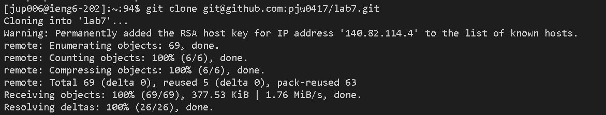

**Lab Report 4**

**Step 4:** Log into ieng6

Keys Pressed:`ssh`<space>`jup006@ieng6.ucsd.edu`<enter>

screenshot1: 

I used `ssh` key with my ucsd id to log into `iegn6 machine` remotely.

**Step 5:** Clone your fork of the repository from your Github account (using the SSH URL)

Keys Pressed: `git`<space>`clone`<space>`git@github.com:pjw0417/lab7.git`<enter>

screenshot2: 

I used `git clone` command with `SSH URL` to `clone` the `forked repo` for edit.

**Step 6:** Run the tests, demonstrating that they fail

Keys Pressed:`cd`<space>`lab7/`<enter>
Keys Pressed:`ls`<enter>
Keys Pressed:`cat`<space>`test.sh`<enter>
Keys Pressed:`bash`<space>`test.sh`<enter>

screenshot3: 

I used `cd` to change directory to `lab7` and ls to see what files are located in `lab7` directory. I used `cat` command to print what kind of test file `test.sh` is. I used `bash` followed by test file name to run the `JUnit test`.

**Step 7:** Edit the code file to fix the failing test

Keys Pressed: `vim`<space>`ListExamples.java`<enter>

screenshot4: 

I used `vim` command followed by the file name, `ListExamples.java` to enter the `vim editor`.

Keys Pressed:`i`
Keys Pressed: <right><delete>`2`<esc>`:wq`<enter>

I used `i` command in `vim` mode to enter editing mode. I was luckily placed right at the editing spot, so I `right arrowed` once and `deleted` 1 and put 2 for `index`. Once I was finished editing, I pressed `esc` to exit editing mode and used `:wq` to quit vim editor with saving the changes to `ListExamples.java` file.

screenshot5: 

**Step 8:** Run the tests, demonstrating that they now succeed

Keys Pressed: `bash`<space>`test.sh`<enter>

screenshot6: 

I used `bash` followed by test file name to `re-run` the `JUnit test`.

**Step 9:** Commit and push the resulting change to your Github account (you can pick any commit message!)

Keys Pressed:`git`<space>`.`<enter>
Keys Pressed:`git`<space>`commit`<space>`-m`<space>`"labreport4"`<enter>
Keys Pressed:`git`<space>`push`<enter>

screenshot7: 

I used `git add .` command to `stage` all changes including deletions to current `directory`. I used `commit` command with `-m` to `commit` my changes with message `"labreport4"`. I used `git push` command to `update` the changes to my `forked repo`. 
